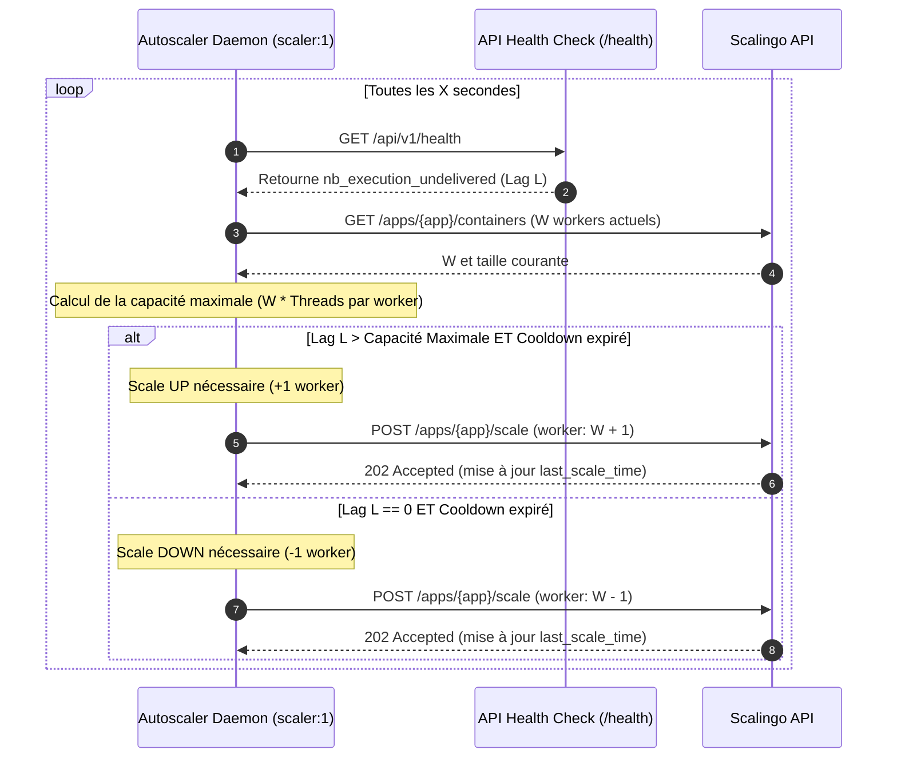

# Document IA Auto-Scaler

Ce sous-projet contient le démon d'auto-scaling applicatif conçu pour ajuster dynamiquement le nombre de conteneurs workers de l'application sur Scalingo en fonction de la charge réelle de la queue de messages Redis.

---

## 1. Architecture de Solution & Régulation

Étant donné que l'auto-scaling natif de Scalingo se limite aux métriques système (CPU/RAM/Swap) et ne prend pas en compte l'état des queues de messages (Redis), nous mettons en place un contrôleur d'auto-scaling applicatif (concept de *Control Loop*).

### Fonctionnement Général

Le démon d'autoscaling s'exécute en continu comme un conteneur indépendant de taille minimale (taille **S**) et effectue à intervalle régulier les étapes suivantes :



### Algorithme de Décision (Hystérésis et Cooldown)

Pour éviter les effets d'oscillation (downscaling et upscaling incessants, dit *thrashing*) et laisser le temps aux nouveaux workers de démarrer, l'algorithme intègre des concepts de **cooldown** :

1. **Scale-Up :**
   Si le `lag` de la queue est supérieur à la capacité théorique cumulée des workers actifs :
   $$\text{lag} > W \times \text{threads per worker}$$
   et que le temps écoulé depuis la dernière action de scaling est supérieur à `SCALE_UP_COOLDOWN`, alors on augmente de $1$ le nombre de workers (sans dépasser `MAX_WORKERS`).


2. **Scale-Down :**
   Si la queue est vide ($\text{lag} = 0$), que le nombre actuel de workers $W > \text{MIN WORKERS}$, et que le temps écoulé depuis la dernière action est supérieur à `SCALE_DOWN_COOLDOWN`, alors on diminue de $1$ le nombre de workers (sans descendre en dessous de `MIN_WORKERS`).

---

## 2. Configuration & Variables d'Environnement

Le projet lit sa configuration via des variables d'environnement gérées par `pydantic-settings` :

| Variable | Description | Valeur par défaut |
| :--- | :--- | :--- |
| `SCALINGO_API_TOKEN` | Clé d'API Scalingo (générée depuis vos paramètres utilisateur). | *Requis* |
| `SCALINGO_APP_NAME` | Nom de l'application sur Scalingo (ex: `document-ia-worker-prod`). | *Requis* |
| `API_HEALTH_URL` | URL complète du healthcheck de votre API (ex: `https://.../api/v1/health`). | *Requis* |
| `CHECK_INTERVAL` | Fréquence de vérification du lag de la queue (en secondes). | `30` |
| `THREAD_PER_WORKER` | Nombre de threads de traitement par conteneur worker. | `10` |
| `MIN_WORKERS` | Nombre minimal de conteneurs workers actifs. | `1` |
| `MAX_WORKERS` | Nombre maximal de conteneurs workers autorisés. | `5` |
| `SCALE_UP_COOLDOWN` | Temps d'attente minimal après un scale-up (en secondes). | `120` |
| `SCALE_DOWN_COOLDOWN` | Temps d'attente minimal après un scale-down (en secondes). | `300` |
| `SCALINGO_API_URL` | Endpoint de l'API Scalingo. | `https://api.scalingo.com` |

---

## 3. Lancement Local & Développement

### Installation des dépendances

```bash
poetry install
```

### Lancement des tests unitaires

Des tests unitaires couvrant les scénarios de décision d'auto-scaling sont disponibles :

```bash
poetry run pytest
```

---

## 4. Déploiement Scalingo

Ce projet contient un [Procfile](file:///Users/nsagon/Projects/beta/documentAI/document-ia/document-ia-auto-scaler/Procfile) configuré pour démarrer le démon d'autoscaling en mode worker :

```yaml
worker: python -m document_ia_auto_scaler.main
```

Pour l'activer, déployez ce sous-projet comme une application Scalingo indépendante (ou configurez votre pipeline CI/CD multideps), puis activez le conteneur `worker` en le scalant à `1` instance (de type **S**).
